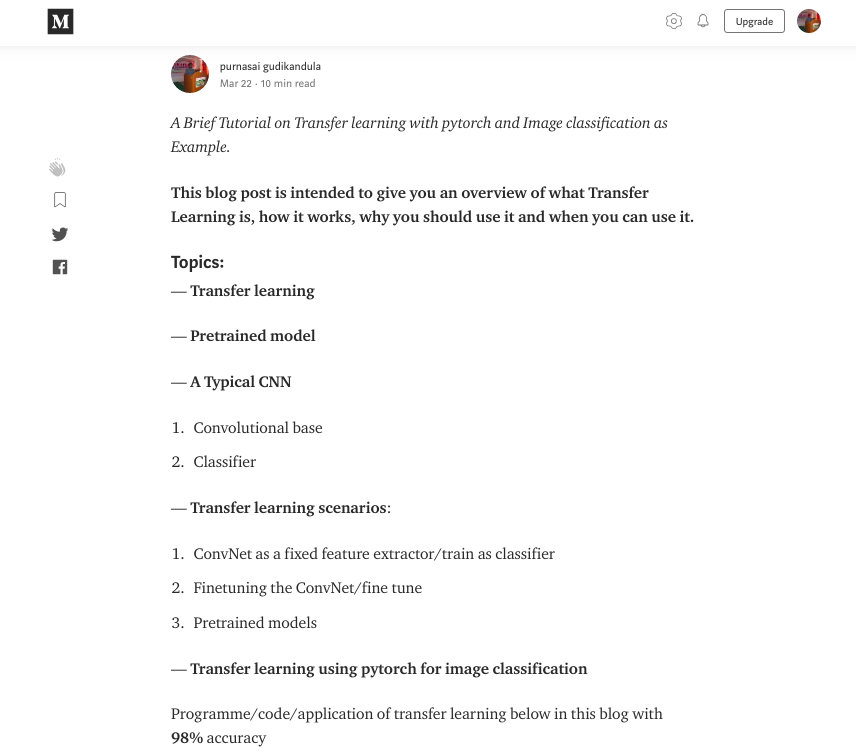
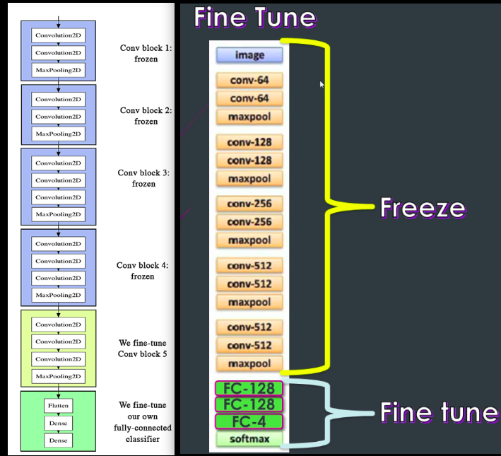
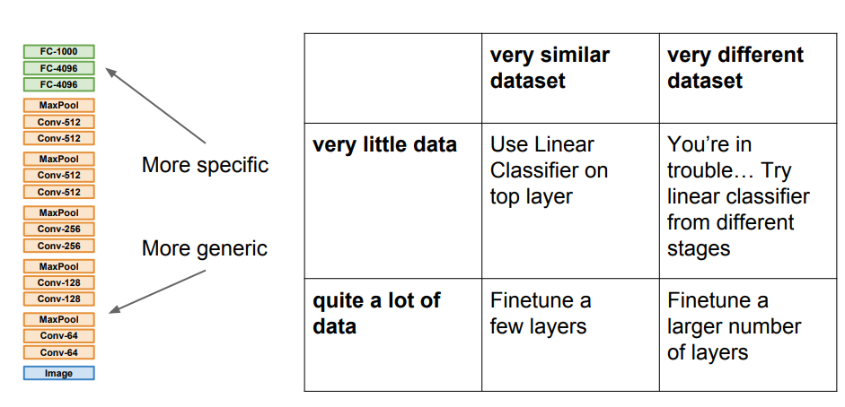
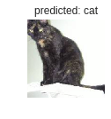
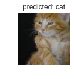
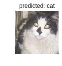
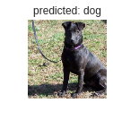
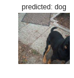

## Blog:
you can check out the explanation to the above code in this **well explained**  blog [here](https://medium.com/@purnasaigudikandula/deep-view-on-transfer-learning-with-iamge-classification-pytorch-5cf963939575)

### Reference
For Reference check out the pytorch official documentation [here](https://pytorch.org/tutorials/beginner/transfer_learning_tutorial.html)

### Dataset:
you can get/download **Dataset** from [here](https://www.kaggle.com/c/dogs-vs-cats)

### Packages:
 -Python
 
 -pytorch

### Results:

at Epoch 24/24
----------
**train Loss**: 0.0822 **Acc**: 0.9650

**val Loss**: 0.0315 **Acc**: 0.9876

**Training complete** in 133m 50s with 4GB Ram + i3 processor

**Best val Acc**: 0.988400

 
 
 
 
 

 
**Note**: 
1. you can also find image classifier of ants and bees [here](https://pytorch.org/tutorials/beginnertransfer_learning_tutorial.html)
2. use **google colab** for fast exeution/GPU support.
3. I renamed "test" folder in dataset to "val" for comfort.
