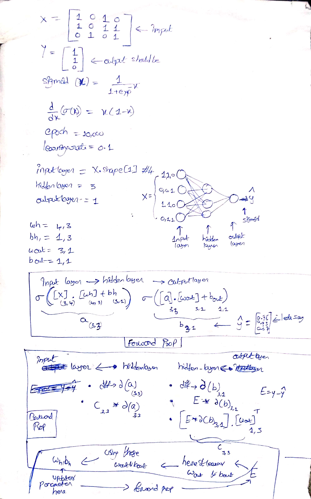

### Neural network from scratch in  python.

I just used **numpy, python** purely to implement this Neural Network in python.

I clearly explained About this concept here in My website. please check it out at [NN from scratch](https://purnasai.github.io/A-Beginner-Intro-to-Neural-Networks/)

To know the theoretical concepts/Background behind Neural Network please chekout this [blog1](https://stackabuse.com/creating-a-neural-network-from-scratch-in-python/)
and this [one](http://www.cristiandima.com/neural-networks-from-scratch-in-python/)

#### explanation:

