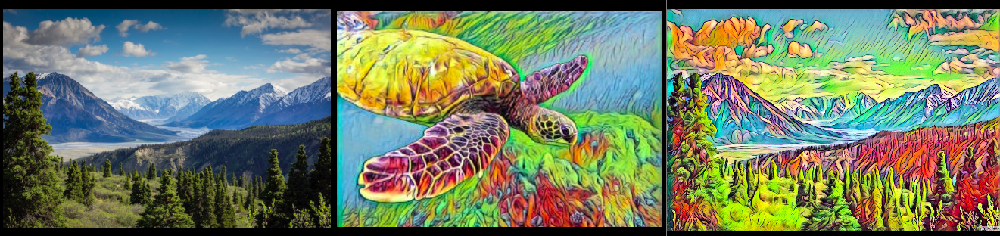
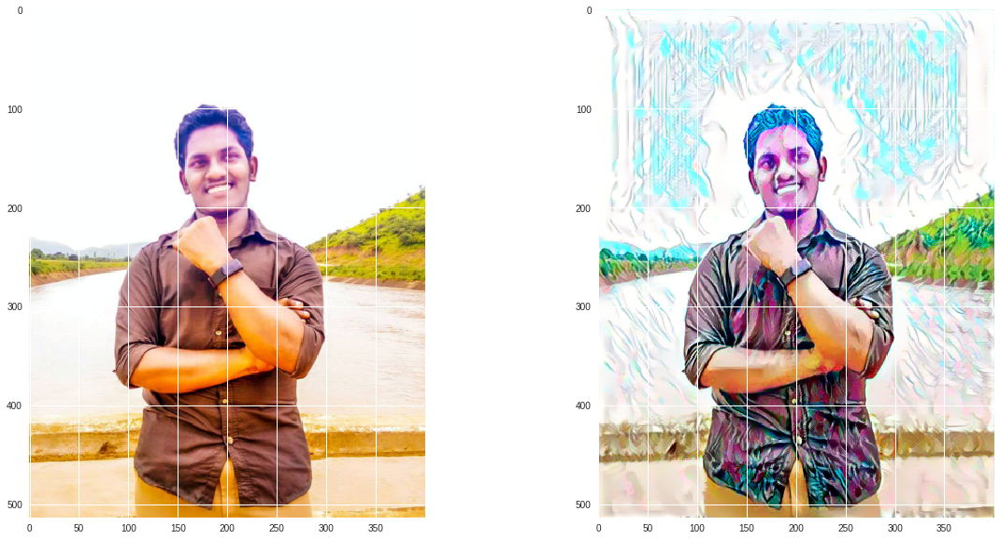
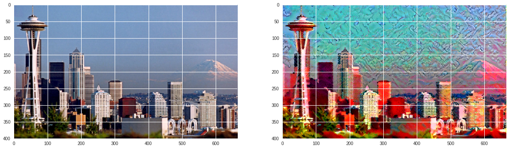

## Blog
please check out the **blog** [here](https://medium.com/@purnasaigudikandula/artistic-neural-style-transfer-with-pytorch-1543e08cc38f)

### OPTIMIZED STYLE TRANSFER(OLD METHOD)

**Optimized Style transfer** is a pretty old method that used **optimization method, starting off with a Random noise image** and making it more and more Desirable with Every "training" iteration of the Neural network.

### Neural_style_transfer(new methog):

used feedforward - train a network to do the stylizations for a given painting beforehand so that it can produce stylized images instantly.

Here you can see 2 folders in the above repository.

**both** the repository follows New method i.e Neural_style_transfer.
 
 
 
